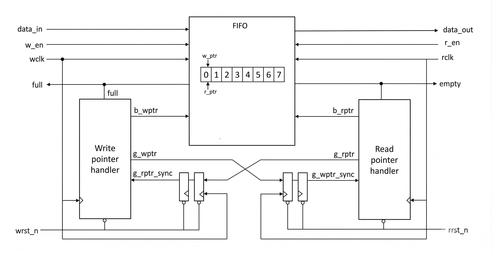
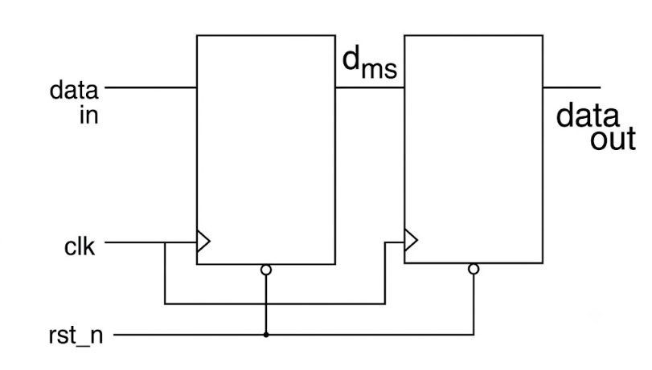
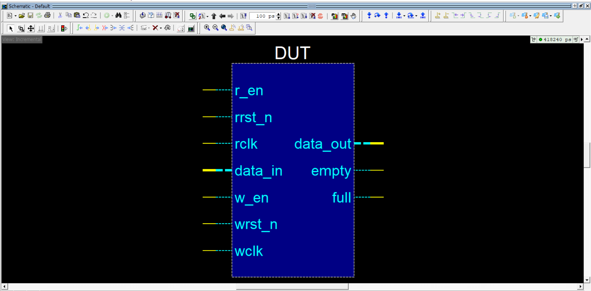
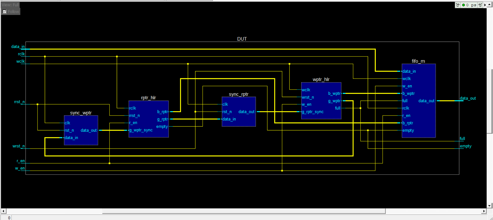
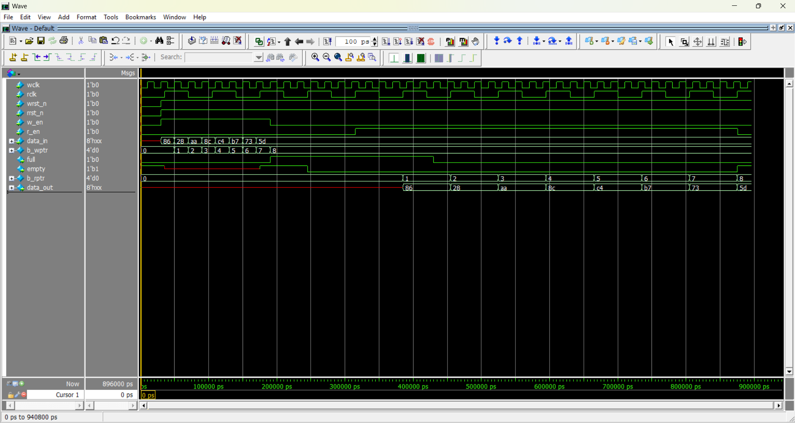
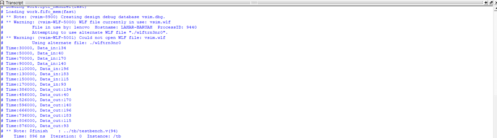

# Design and Verification of Asynchronous FIFO 

This project showcases the design and verification of a parametrized Asynchronous FIFO with CDC handling.
The schematic has been generated and simulation has been performed using Siemens QuestaSim 10.7c Simulator.

An **Asynchronous First-In-First-Out (FIFO)** is a memory buffer or queue.
- It is a critical structural component used to safely pass data between two systems operating on different, unsynchronized clock frequencies.
- Since write and read clocks are not synchronized, it is referred to as **asynchronous** FIFO.

-------------------------------------------------------------------

## Use Cases of FIFO

- Clock Domain Crossing (CDC): Transfer data between blocks running on different clocks.
- Data Buffering: Smoothens data transfer between producer and consumer.
- Rate Matching: Balances data rates between fast and slow subsystems.
- Serial Communication: UART, SPI buffering.
- Pipeline Staging: Holds data in pipelined digital designs.
  
-------------------------------------------------------------------

## Architecture 

The architectural design is partitioned into 4 functional blocks - 

### Write Pointer Handler:

- It operates in the **write clock domain.** 
- It increments the binary write pointer, converts it to Gray code and generates the FIFO 'full' condition to **prevent write overflows.**

### Read Pointer Handler:

- Operates in the read clock domain. 
- It increments the binary read pointer, converts it to Gray code, and generates the FIFO 'empty' condition to prevent reading invalid data.
  
### Synchronizers: 

In this project, 2-Flip-Flop (2FF) synchronizers are utilized to safely pass: 
- the **Gray-coded read pointer** into the write domain. 
- the **Gray-coded write pointer** into the read domain.

**NOTE:** A single “2 FF synchronizer” can resolve metastability for **only one bit**. Hence, depending on write and read pointers multiple 2FF synchronizers are required. 

### FIFO Memory:
 A parameterized memory array where data is written using the write clock and read using the read clock.

-------------------------------------------------------------------

## Key challenges in Asynchronous FIFO

- Metastability due to clock domain crossing
- Safe pointer synchronization (write pointer in read clock domain and vice versa)
- Full and empty flag generation without timing errors.

-------------------------------------------------------------------

## Concepts related to Asynchronous FIFO Design

### Metastabiltiy

- Metastability occurs when a flip-flop receives a signal too close to its clock edge, violating setup or hold time. As a result, the output becomes unstable—neither a logical 0 nor 1—for an unpredictable time.

### Metastability Solution: 

- A 2FF synchronizer can resolve metastability.
- FlipFlop1 may go to metastability but FlipFlop2 will captures the stable output safely.

### Clock Domain Crossing(CDC)

- Clock Domain Crossing refers to the transfer of data or control signals from one clock domain to another when both domains are running at different frequencies or phases.

#### Why is CDC challenging?

- Timing is unpredictable because the clocks are asynchronous.
- Signals can arrive mid-transition, leading to metastability.
- It can cause glitches, data corruption, or functional errors if not handled properly.

### Gray Code Conversion: 

- Passing binary pointers directly across clock domains causes severe metastability because **multiple bits** can transition simultaneously. 
- This design converts binary pointers to Gray code before synchronization, ensuring **only a single bit** changes state at any given time.

### Empty/Full Flag Logic Generation:

- The **Empty flag** is evaluated in the **read domain** by checking if the synchronized Gray write pointer equals the next Gray read pointer.

        rempty = (g_wptr_sync == g_rptr_next);

- This ensures the FIFO does not **underflow** during asynchronous operation.

- The **Full flag** is evaluated in the write domain by checking if the next Gray write pointer's MSBs are inverted compared to the synchronized Gray read pointer, while the LSBs match.

        wfull = (g_wptr_next == {~g_rptr_sync[PTR_WIDTH:PTR_WIDTH-1], g_rptr_sync[PTR_WIDTH-2:0]});

- This ensures the FIFO does not **overflow** during asynchronous operation.

-------------------------------------------------------------------

Schematic
 

The Schematics has been generated using Questasim 10.7c.

## Asynchronous FIFO Top module 

## FIFO Sub-Modules 

-------------------------------------------------------------------

Simulation
 

The simulation has been performed using Questasim 10.7 as well.

-------------------------------------------------------------------

Console Ouput
 

-------------------------------------------------------------------

## Simulation Steps

To compile the RTL and simulate the design , run the `run.do` file in Questasim.

-------------------------------------------------------------------

## References & Acknowledgments

The following blog has been followed for theory and practical implementation of this Asynchronous FIFO project.

- [VLSI Verify Blog on Asynchronous FIFO](https://vlsiverify.com/verilog/verilog-codes/asynchronous-fifo/)